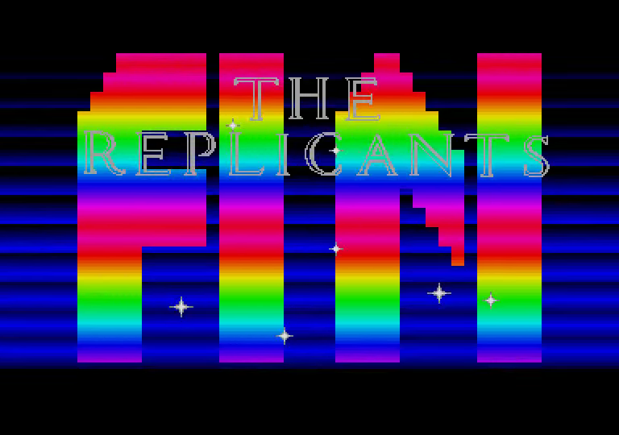
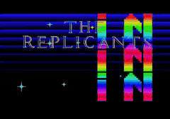

# Go DOM Intro

<!-- Project showcase -->
## Screenshots

Rainbow lettering and stars behind The Replicants overlay.

## Video

**[Watch or download the 24-second MP4 preview with sound](https://github.com/olivierh59500/go-dom-intro/raw/refs/heads/main/docs/media/preview.mp4)**

This preview is captured from the Go production.

The animated image is silent; the MP4 includes the soundtrack.

<!-- End project showcase -->

## Optional DCK version

The original implementation remains at its original paths. Run it with `go run ./cmd/domintro`.

The construction-kit version is in [dck/](dck/README.md). Run `go run ./dck/cmd/domintro` from this directory. Both versions share the original assets.
